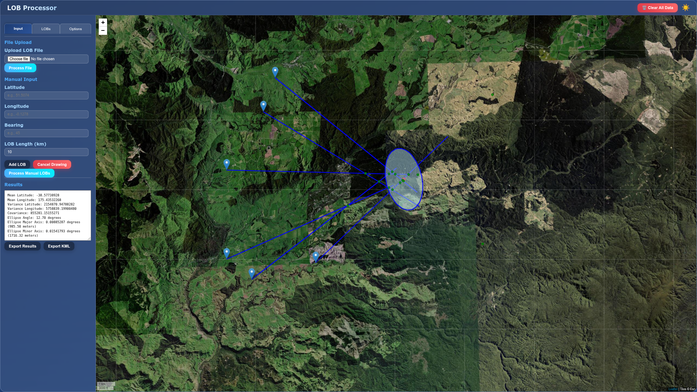

# lobs2geo
Apply Lines-Of-Bearing from a direction-finding system, calculate a geolocation estimate, and present the results on a map.  

This interactive web application processes Lines of Bearing (LOBs) to estimate the geographic location of a target, displaying results on a Leaflet map. It supports both file-based LOB input and manual drawing of LOBs directly on the map. The application calculates and visualizes the mean intersection point and an error ellipse, providing tools for analysis and export.

## Features

*   **File Input:** Upload LOB data from text files.
*   **Manual Input:** Manually enter Latitude, Longitude, and Bearing.
*   **Interactive LOB Drawing:** Draw LOBs directly on the map by clicking a start point and an end point.
    *   Configurable LOB length for drawn lines.
*   **Dynamic LOB List:** View all processed LOBs in a table format with Latitude, Longitude, and Bearing.
    *   Toggle individual LOBs on/off for processing and display.
*   **Intersection Calculation:** Robust calculation of LOB intersection points.
    *   Configurable maximum LOB intersection distance to filter out distant or erroneous intersections.
*   **Error Ellipse Visualization:** Displays a confidence ellipse around the estimated target location.
    *   Configurable confidence level for the ellipse.
*   **Map Customization:** Switch between different map styles (OpenStreetMap, CartoDB Dark/Light, Satellite).
*   **Theme Toggling:** Switch between light and dark modes for the application interface.
*   **Results Display:** Detailed processing results shown in a dedicated sidebar window.
*   **Export Options:**
    *   Export processed results and LOB data to a text file.
    *   Export LOBs, mean intersection, and error ellipse to a KML file for use in Google Earth or other GIS software.
*   **Dynamic Title Bar:** Displays the name of the currently processed file in the application title bar.

## How to Use



1.  **Open the Application:** Open the `index.html` file in a modern web browser.
2.  **Input LOBs:**
    *   **File Upload (Input Tab):** Click "Upload LOB File" and select a text file (see "File Format" below). Click "Process File".
    *   **Manual Input (Input Tab):** Enter Latitude, Longitude, Bearing, and desired LOB Length (km). Click "Add LOB" to add to the list, or "Draw LOB" to interactively draw on the map. Click "Process Manual LOBs" to process the added LOBs.
3.  **View LOBs:** Navigate to the "LOBs" tab to see a table of all loaded LOBs. Use the checkboxes to enable/disable individual LOBs for processing.
4.  **Configure Options:** Go to the "Options" tab to adjust map style, confidence level for the error ellipse, and the maximum LOB intersection distance.
5.  **Analyze Results:** The "Results" text area will display statistical information about the estimated target location and error ellipse.
6.  **Export Data:** Use the "Export Results" button to save a text file of LOB data and processed results, or "Export KML" to generate a KML file for mapping software.
7.  **Clear Data:** Use the "Clear All Data" button to reset the application.

## File Format

The input file should be a text file with each line representing a Line of Bearing (LOB) in the following format:

```
Lat: <latitude> Lon: <longitude> Alt <altitude> LOB: <lob> LOE: <loe> ID: <obj_id> Prob: <prob> Track ID: <track_id>
```

**Example:**

```
Lat: -38.62155975 Lon: 175.35122347 Alt  4.7 LOB: 120.63 LOE: -0.21 ID:  0 Prob: 0.78 Track ID:  0
Lat: -38.62200000 Lon: 175.35000000 Alt  5.0 LOB: 130.00 LOE: -0.50 ID:  1 Prob: 0.90 Track ID:  0
```

## Development

The application is built using HTML, CSS, and JavaScript, leveraging the Leaflet.js library for mapping and math.js for mathematical operations.

### Project Structure

*   `index.html`: Main application interface.
*   `style.css`: Styling for the application.
*   `script.js`: Core application logic, LOB processing, and map interactions.
*   `sample_lobs.txt`: Example LOB data file
*   
